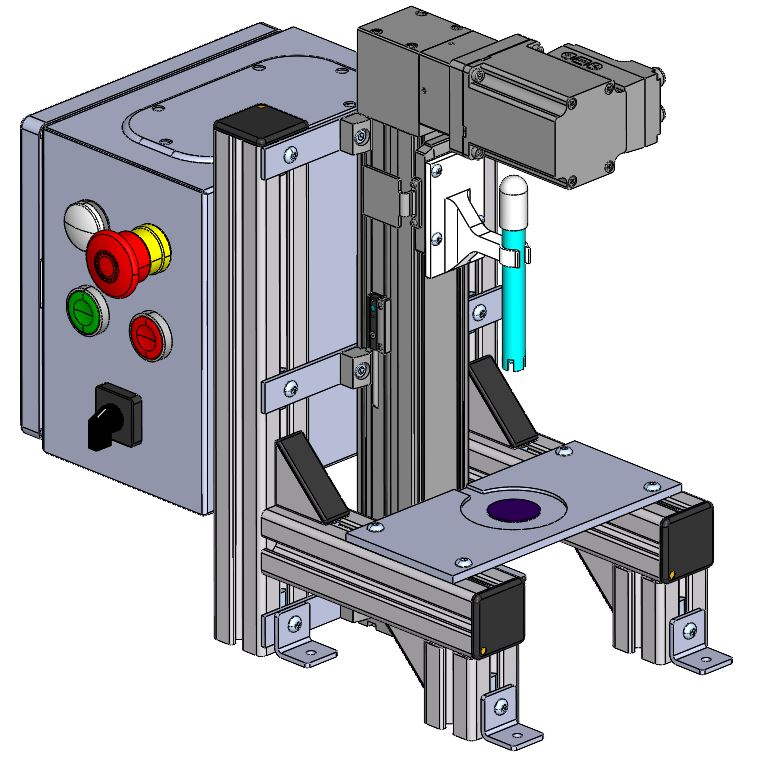

# IoT-Project
## Sections

 - [Visuals](#visuals)
 - [Description](#description)
	 - [General](#general)
	 - [Programming languages and libriaries](#programming-languages-and-libraries)
	 - [Main features](#main-features)
   - [Results](#results)
   - [Next steps](#next-steps)
 - [Usage](#usage)

## Visuals

## Description

### General

This project was created to allow pH measurment of an electrolyte in Plasma Electrolytic Oxidation Process
and store the data in a SQL database by sending it to the local host through WiFi. 
Used SoC in the project is ESP32 which has a WiFi module. The Local server was created using WampServer software.  
The ESP32 and the display are powered by 5 V. The pH sensor is powered by the ESP32.
The sensor data line is connected to the analog input of the D34 microcontroller.
Pins D18, D19, D21, D22, D23 are connected to the LED screen and enable the exchange of information between devices.
Three LEDs are connected to the digital outputs D27, D26 and D25. The pin 33 pull-up resistor is used, which is connected to the button.
By pressing the button the pH measurment starts and the data is sent to the database.
By pressing the button for the second time it stops the stream of the data.
The potentiometer allows you to adjust the display contrast and is connected to the LCD display.

### Programming languages and libraries

 - C/C++

### Main features

- pH measurment
- wireless communication
- WiFi connection
- Monostable button control (ON / OFF)

### Results

### Next steps

I proposed a construction model which allows to automate the pH measurement. The main element of the station is an electric linear drive,
which is responsible for the translational movement of the pH sensor and allows the electrolyte to be immersed in the sample. 
In order to hold the working part in an intermediate position, an inductive position sensor has been added, which detects the presence of the working part 
when it is at its mounting height. The elements to which the linear drive is attached are modular aluminum profiles, which also form the frame of the stand. 
The working part of the linear drive that moves is equipped with fixing holes. A gripper is screwed to the working part, which enables the attachment of the pH sensor.
A flat bar with a milled round area was attached to the horizontal aluminum profiles to allow the setting of the electrolyte sample. 
In addition, a pressure sensor has been added in the milled area, which indicates the presence of a sample. The station is equipped with a control cabinet attached to vertical aluminum profiles.   
The next step of this project would be to create that model using real components.

## Usage

 - University project
 - pH measurment using IoT
